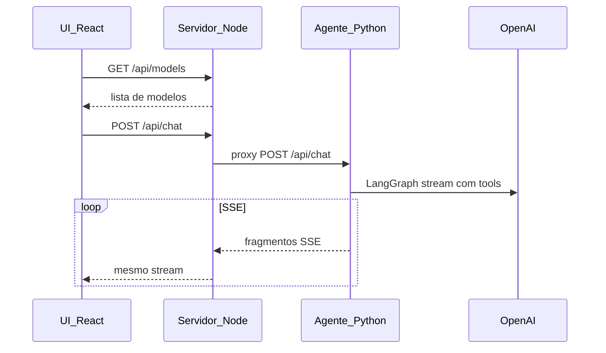

# Studio Chat (Node + React + SSE + OpenAI)

Aplicação de chat estilo assistente com respostas em **streaming** via **Server-Sent Events (SSE)**. O **agente LangGraph** (Python / FastAPI) usa a API OpenAI com ferramentas de **previsão do tempo** (Open-Meteo, sem chave) e **geração de PDF** (texto simples; ficheiros em `apps/agent/data/generated/`, descarregáveis via `GET /api/files/:id` através do Node). A chave **`OPENAI_API_KEY`** existe **só** em `apps/agent/.env`; o browser nunca a vê.

## Interface


## Arquitetura

O browser fala **apenas** com o **Node (Fastify)**. O Node valida CORS e modelo, faz **proxy** do `POST /api/chat` (stream SSE) e do `GET /api/files/:id` para o **agente Python** (`AGENT_URL`).



### Etapas do fluxo

1. A UI obtém modelos com `GET /api/models` (lista permitida no servidor).
2. No envio, a UI envia histórico + modelo em `POST /api/chat`.
3. O Node reencaminha ao agente (`AGENT_URL`, por defeito `http://127.0.0.1:8001`).
4. O agente (LangGraph + ChatOpenAI) pode usar **previsao_tempo** e **gerar_pdf**; a resposta chega em SSE (`content`, opcionalmente `file`, depois `done`).
5. PDFs: evento SSE `file` com URL relativa; o download é `GET /api/files/:id` (Node → agente).
6. O evento `done` termina o streaming na UI.

## Requisitos

| Ferramenta | Versão |
|------------|--------|
| Node.js | 20+ |
| Python | 3.9+ (recomendado 3.11+) |
| npm | Incluído com Node |

- Chave **OpenAI** apenas em `apps/agent/.env` (`OPENAI_API_KEY`).

## Primeira configuração

Na **raiz** do repositório:

```bash
npm install
```

**Agente Python** (uma vez):

```bash
cd apps/agent
python3 -m venv .venv
source .venv/bin/activate   # Windows: .venv\Scripts\activate
pip install -r requirements.txt
cp .env.example .env
# Edite .env e defina OPENAI_API_KEY
cd ../..
```

**Servidor Node** (ficheiro de ambiente):

```bash
cp apps/server/.env.example apps/server/.env
# Ajuste AGENT_URL se o agente não usar a porta 8001
```

Os ficheiros `.env` estão no `.gitignore` e não devem ser commitados.

## Comandos npm (raiz do repositório)

| Comando | Descrição |
|---------|-----------|
| `npm run dev:full` | Arranca **em paralelo**: agente Python (8001), API Node (3001) e Vite (5173). Recomendado para desenvolvimento. |
| `npm run dev:agent` | Só o agente FastAPI/Uvicorn em `0.0.0.0:8001` (requer `apps/agent/.venv` e dependências instaladas). |
| `npm run dev:server` | Só o Fastify em `0.0.0.0:3001` (workspace `apps/server`). |
| `npm run dev:web` | Só o frontend Vite (workspace `apps/web`). |
| `npm run build` | Build de `apps/server` e `apps/web`. |

O pacote `concurrently` (devDependency na raiz) é usado por `dev:full`.

## Iniciar a stack de desenvolvimento

### Opção recomendada: tudo num único terminal

```bash
npm run dev:full
```

Abra **`http://localhost:5173`**. O Vite faz proxy de `/api` para **`http://localhost:3001`** (Node).

**Importante:** `apps/server/.env` deve ter **`AGENT_URL`** com a **mesma porta** que o Uvicorn do agente. O script `dev:agent` usa **`--port 8001`**; o valor típico é:

```env
AGENT_URL=http://127.0.0.1:8001
```

Se `AGENT_URL` apontar para outra porta (ex.: 8000) e o agente estiver na 8001, o chat devolve **503** (`ECONNREFUSED`).

### Opção: três terminais separados

1. **Agente** — `npm run dev:agent` (ou manualmente `cd apps/agent` e o comando `uvicorn` da secção [Agente manual](#agente-manual-uvicorn)).
2. **API Node** — `npm run dev:server` (ou `cd apps/server && npm run dev`).
3. **UI** — `npm run dev:web` (ou `cd apps/web && npm run dev`).

### Agente manual (uvicorn)

```bash
cd apps/agent
source .venv/bin/activate
PYTHONPATH=. uvicorn src.main:app --reload --host 0.0.0.0 --port 8001
```

### Portas em desenvolvimento

| Serviço | Porta | URL local típica |
|---------|-------|-------------------|
| Frontend (Vite) | 5173 | `http://localhost:5173` |
| API Node (Fastify) | 3001 | `http://localhost:3001` |
| Agente (FastAPI / Uvicorn) | 8001 | `http://127.0.0.1:8001` |

## Verificar saúde da stack

- **Node + reachability do agente:** `GET http://localhost:3001/api/health`  
  Resposta inclui `agent.url`, `agent.reachable` e, se falhar, `agent.error`. Convém **`reachable: true`** antes de testar o chat.

- **Agente direto:** `GET http://127.0.0.1:8001/api/health` (se o agente estiver a correr).

Exemplo:

```bash
curl -sS http://localhost:3001/api/health
```

## Eventos SSE (contrato com o frontend)

O stream de `POST /api/chat` envia linhas `data: {JSON}\n\n` com, entre outros:

| `type` | Significado |
|--------|-------------|
| `content` | `delta`: texto a acrescentar à mensagem do assistente |
| `file` | `url`, `filename`: link para descarregar um PDF gerado pela ferramenta |
| `done` | Fim do stream |
| `error` | `message`: erro a mostrar ao utilizador |

## Aceder a partir de outra máquina na mesma rede

1. **Vite** — Com `server.host: true` no `vite.config.ts`, o terminal mostra um URL **Network** (ex.: `http://192.168.x.x:5173`). Use-o no outro equipamento na mesma LAN.

2. **Firewall** — Permita entrada na porta **5173** na máquina de desenvolvimento.

3. **CORS** — O `Origin` será o IP do Vite, não `localhost`. Em `apps/server/.env`, por exemplo:  
   `CORS_ORIGIN=http://localhost:5173,http://192.168.1.10:5173`  
   (substitua pelo IP real).

O proxy do Vite (`/api` → `localhost:3001`) corre na máquina onde corre o dev server; o cliente remoto só precisa de alcançar a porta **5173**.

## Resolução de problemas

| Sintoma | Causa provável |
|---------|----------------|
| **503** no `POST /api/chat` com `ECONNREFUSED` | Agente parado ou **`AGENT_URL`** com porta diferente da do Uvicorn. Confirme com `/api/health`. |
| **503** com mensagem sobre OpenAI | `OPENAI_API_KEY` em falta ou inválida em `apps/agent/.env`. |
| Modelos não carregam | API Node não acessível; confirme `npm run dev:server` ou `dev:full`. |
| PDF não descarrega | Agente tem de ter gerado o ficheiro; URL relativa `/api/files/...` deve passar pelo Node (mesma origem ou `VITE_API_URL` em produção). |

## Build de produção

```bash
npm run build
```

- API compilada em `apps/server/dist` — `npm start -w apps/server` após build.
- Frontend em `apps/web/dist`.

## Frontend e API em hosts diferentes

No build do frontend, defina a URL pública da API (não é segredo):

```bash
VITE_API_URL=https://api.exemplo.com npm run build -w apps/web
```

## Estrutura do monorepo

- **`apps/agent`** — FastAPI + LangGraph: `POST /api/chat` (SSE), `GET /api/files/:id`, `GET /api/health`; ferramentas `previsao_tempo`, `gerar_pdf`; PDFs em `data/generated/` (ignorados pelo Git exceto `.gitkeep`).
- **`apps/server`** — Fastify: `GET /api/health`, `GET /api/models`, proxy de `POST /api/chat` e `GET /api/files/:id` para `AGENT_URL`.
- **`apps/web`** — React, Vite, Tailwind, leitura incremental do stream SSE.

Repositório GitHub: [studio-chat](https://github.com/Waelson/studio-chat) (nome do remoto pode variar).
