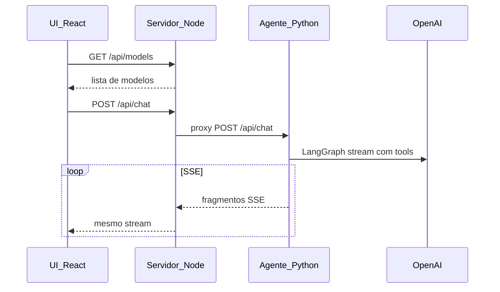

# Studio Chat (Node + React + SSE + OpenAI)

Aplicação de chat estilo assistente com respostas em **streaming** via **Server-Sent Events (SSE)**. O **agente LangGraph** (Python) usa a API OpenAI com ferramentas de **previsão do tempo** (Open-Meteo) e **geração de PDF** (texto simples; ficheiros em `apps/agent/data/generated/`, descarregáveis via `GET /api/files/:id` através do Node). A chave `OPENAI_API_KEY` existe **só no serviço Python** (`apps/agent`); o browser nunca a vê.

## Interface


## Fluxo do chat (diagrama de sequência)

Comunicação entre **UI**, **Node (Fastify)**, **agente Python** e **OpenAI**. O browser fala só com o Node; o Node faz **proxy do stream** para o agente.



### Etapas (em sequência)

1. A UI pede ao Node a lista de modelos (`GET /api/models`) e escolhe o modelo.
2. No envio, a UI manda histórico e modelo ao Node (`POST /api/chat`).
3. O Node valida e reencaminha o pedido ao **agente Python** (`AGENT_URL`, por defeito `http://127.0.0.1:8001`).
4. O agente (LangGraph + ChatOpenAI) pode invocar ferramentas (**tempo**, **PDF**) e devolve a resposta em **SSE**; o Node **encaminha o stream** sem alterar o formato.
5. Se for gerado um PDF, o agente envia um evento SSE `file` com o URL de download; o browser obtém o ficheiro com `GET /api/files/:id` (proxy para o Python).
6. O evento `done` fecha o fluxo na UI.

O Node continua a **validar modelo e CORS**; o segredo da OpenAI fica **no Python**.

## Requisitos

- Node.js 20+
- Python 3.9+ (recomendado 3.11+) com `pip`
- Chave de API OpenAI (`OPENAI_API_KEY`) **no agente** (`apps/agent/.env`)

## Configuração segura da chave

1. Copie `apps/agent/.env.example` para `apps/agent/.env` e defina **`OPENAI_API_KEY`** (só aí).
2. Copie `apps/server/.env.example` para `apps/server/.env` e, se necessário, **`AGENT_URL`** (por defeito `http://127.0.0.1:8001`).
3. Não coloque a chave em `apps/web` nem em variáveis `VITE_*`.
4. Os `.env` estão no `.gitignore`.

## Desenvolvimento

**1 — Agente Python** (porta 8001):

```bash
cd apps/agent
python3 -m venv .venv
source .venv/bin/activate
pip install -r requirements.txt
cp .env.example .env
# Defina OPENAI_API_KEY em .env

PYTHONPATH=. uvicorn src.main:app --reload --host 0.0.0.0 --port 8001
```

Na **raiz** do repositório, depois do `venv` e do `pip install`, pode usar: `npm run dev:agent` (Unix/macOS; exige `apps/agent/.venv`).

**2 — API Node** (porta 3001; proxy SSE → agente):

Em `apps/server/.env`, **`AGENT_URL` tem de coincidir com a porta do Uvicorn** (por omissão `http://127.0.0.1:8001`, igual a `npm run dev:agent`). Se a porta no `.env` não for a mesma que o Uvicorn usa, o chat devolve 503 (`ECONNREFUSED`) mesmo com `npm run dev:full` a arrancar o Python.

```bash
cd apps/server
cp .env.example .env
npm run dev
```

**3 — UI** (Vite, porta 5173; proxy `/api` → `http://localhost:3001`):

```bash
cd apps/web
npm run dev
```

Abra `http://localhost:5173`.

### Aceder a partir de outra máquina na mesma rede

1. **Vite na rede** — O `vite.config.ts` usa `server.host: true`, por isso ao correr `npm run dev` na pasta `apps/web` o terminal mostra também um endereço **Network** (ex.: `http://192.168.x.x:5173`). Use esse URL no browser do outro computador (a máquina que corre o dev server tem de estar na mesma LAN).

2. **Firewall** — Na máquina de desenvolvimento, permita tráfego de entrada na porta **5173** (macOS: Definições do Sistema → Rede → Firewall, ou regra para `node`).

3. **CORS** — O browser noutro PC envia `Origin: http://192.168.x.x:5173`, não `localhost`. No `apps/server/.env`, defina origens explícitas, por exemplo:
   `CORS_ORIGIN=http://localhost:5173,http://192.168.1.10:5173`  
   (substitua pelo IP real da máquina onde corre o Vite). Sem isto, os pedidos a `/api` podem falhar no browser apesar da página carregar.

O proxy do Vite (`/api` → `localhost:3001`) continua a correr **na máquina do dev**; o outro equipamento só precisa de alcançar a porta **5173**.

## Build

```bash
npm run build
```

- API compilada em `apps/server/dist` (`npm run build -w apps/server` + `npm start -w apps/server`).
- Frontend em `apps/web/dist`.

## Frontend e API em hosts diferentes

Defina no build do frontend uma URL base pública (não secreta), por exemplo:

```bash
VITE_API_URL=https://api.exemplo.com npm run build -w apps/web
```

## Estrutura

- `apps/agent` — FastAPI + LangGraph, `POST /api/chat` (SSE), `GET /api/files/:id` (PDFs gerados), ferramentas tempo + PDF; PDFs temporários em `data/generated/` (ignorados pelo Git exceto `.gitkeep`).
- `apps/server` — Fastify: `GET /api/health`, `GET /api/models`, proxy de `POST /api/chat` e `GET /api/files/:id` para `AGENT_URL`.
- `apps/web` — React, Vite, Tailwind, leitura incremental do stream SSE.
