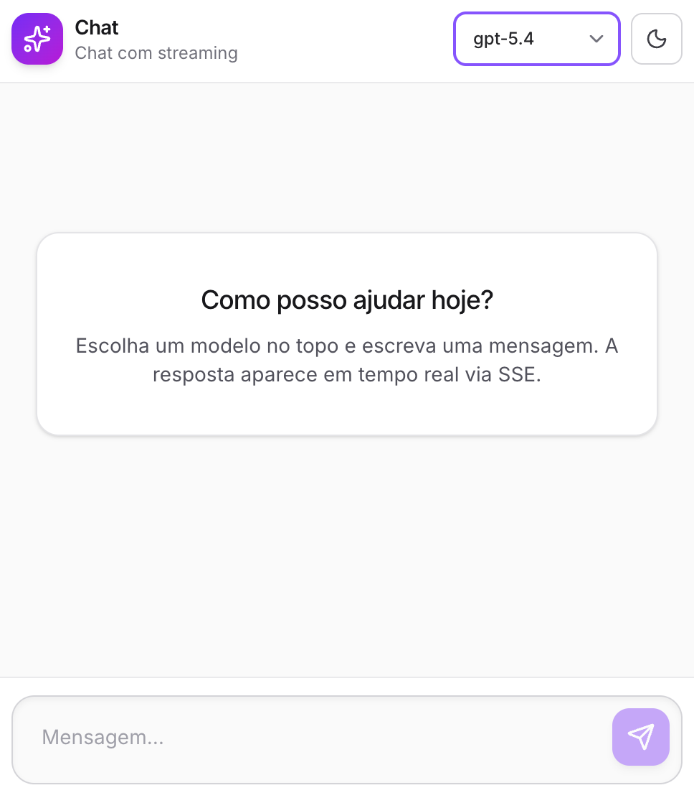
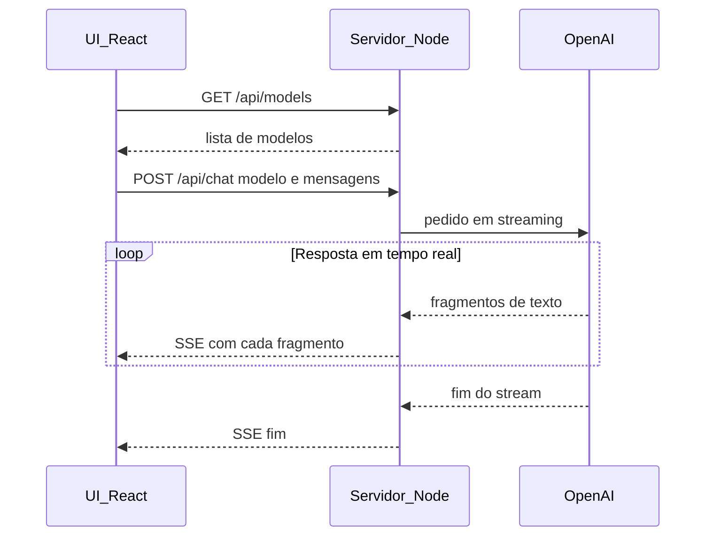

# Studio Chat (Node + React + SSE + OpenAI)

Aplicação de chat estilo assistente com respostas em **streaming** via **Server-Sent Events (SSE)**. A chave da OpenAI existe **apenas no backend** — nunca no browser nem em variáveis `VITE_*`.

## Interface



## Fluxo do chat (diagrama de sequência)

Comunicação entre **UI**, **servidor** (Node) e **OpenAI**. O browser nunca fala diretamente com a OpenAI; só o servidor usa a chave de API.



### Etapas (em sequência)

1. A UI pede ao servidor a lista de modelos (`GET /api/models`) e o utilizador escolhe um.
2. Ao enviar o chat, a UI manda o histórico e o modelo ao servidor (`POST /api/chat`).
3. O servidor contacta a OpenAI em modo **stream** e vai recebendo a resposta aos poucos.
4. O servidor reenvia cada parte ao browser como **SSE**; a UI junta esses fragmentos e mostra o texto a aparecer em tempo real.
5. Quando a OpenAI termina, o servidor fecha o fluxo SSE e a UI deixa de tratar a resposta como “em curso”.

O papel do servidor é **proxy seguro**: esconde a chave, valida o pedido e faz de ponte entre HTTP/SSE e a API da OpenAI.

## Requisitos

- Node.js 20+
- Chave de API OpenAI (`OPENAI_API_KEY`)

## Configuração segura da chave

1. Copie `apps/server/.env.example` para `apps/server/.env`.
2. Defina `OPENAI_API_KEY` **só** nesse ficheiro (ou via variáveis de ambiente no processo do servidor em produção).
3. O ficheiro `.env` está no `.gitignore` e não deve ser commitado.
4. **Não** coloque a chave em `apps/web` nem use prefixo `VITE_` para segredos — tudo com `VITE_` é embutido no bundle do cliente.

Em produção, injete `OPENAI_API_KEY` pelo runtime (Docker/Kubernetes/PaaS) ou use um gestor de segredos (AWS Secrets Manager, Vault, etc.).

## Desenvolvimento

Terminal 1 — API (porta 3001):

```bash
cd apps/server
cp .env.example .env
# Edite .env e defina OPENAI_API_KEY

npm run dev
```

Terminal 2 — UI (Vite, porta 5173; proxy `/api` → `http://localhost:3001`):

```bash
cd apps/web
npm run dev
```

Abra `http://localhost:5173`.

### Aceder a partir de outra máquina na mesma rede

1. **Vite na rede** — O `vite.config.ts` usa `server.host: true`, por isso ao correr `npm run dev` na pasta `apps/web` o terminal mostra também um endereço **Network** (ex.: `http://192.168.x.x:5173`). Use esse URL no browser do outro computador (a máquina que corre o dev server tem de estar na mesma LAN).

2. **Firewall** — Na máquina de desenvolvimento, permita tráfego de entrada na porta **5173** (macOS: Definições do Sistema → Rede → Firewall, ou regra para `node`).

3. **CORS** — O browser noutro PC envia `Origin: http://192.168.x.x:5173`, não `localhost`. No `apps/server/.env`, defina origens explícitas, por exemplo:
   `CORS_ORIGIN=http://localhost:5173,http://192.168.1.10:5173`  
   (substitua pelo IP real da máquina onde corre o Vite). Sem isto, os pedidos a `/api` podem falhar no browser apesar da página carregar.

O proxy do Vite (`/api` → `localhost:3001`) continua a correr **na máquina do dev**; o outro equipamento só precisa de alcançar a porta **5173**.

## Build

```bash
npm run build
```

- API compilada em `apps/server/dist` (`npm run build -w apps/server` + `npm start -w apps/server`).
- Frontend em `apps/web/dist`.

## Frontend e API em hosts diferentes

Defina no build do frontend uma URL base pública (não secreta), por exemplo:

```bash
VITE_API_URL=https://api.exemplo.com npm run build -w apps/web
```

## Estrutura

- `apps/server` — Fastify, `GET /api/health`, `GET /api/models`, `POST /api/chat` (SSE).
- `apps/web` — React, Vite, Tailwind, leitura incremental do stream SSE.
